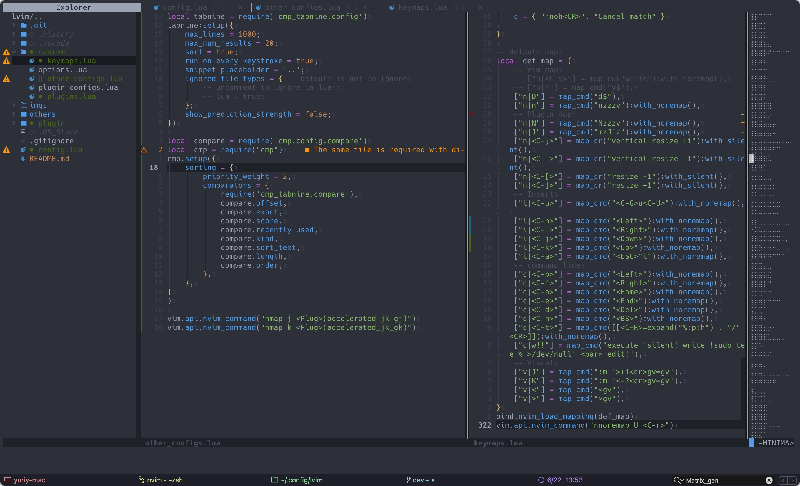

# 💥 YuriyVim
Modified the neovim configuration based on lunarVim. Rewrote some of the functions of lunarVim, and detailed commenting of the which_key keys to make it easier to use. And integrated some new plugins, so that the overall functionality is more complete, in the development can be used instead of VSCode to edit and debug code.

## ✨ Example
1. Menu

2. Split files

3. Jump between different words or lines

4. Embedded terminal


## 📦 Install
First, you should make sure lunarVim has been installed.
for LunarVim, you can clone it by 
```bash
git clone https://github.com/LunarVim/LunarVim.git
```
If LunarVim has been installed and is running without any problems, the configuration can be set up by cloning the following command.
```bash
git clone https://github.com/Yurun-LI/YuriyVim.git ~/.config/lvim
```
And then, run `:PackerSync` to synchronize the pluigns and the configuration is finished.

